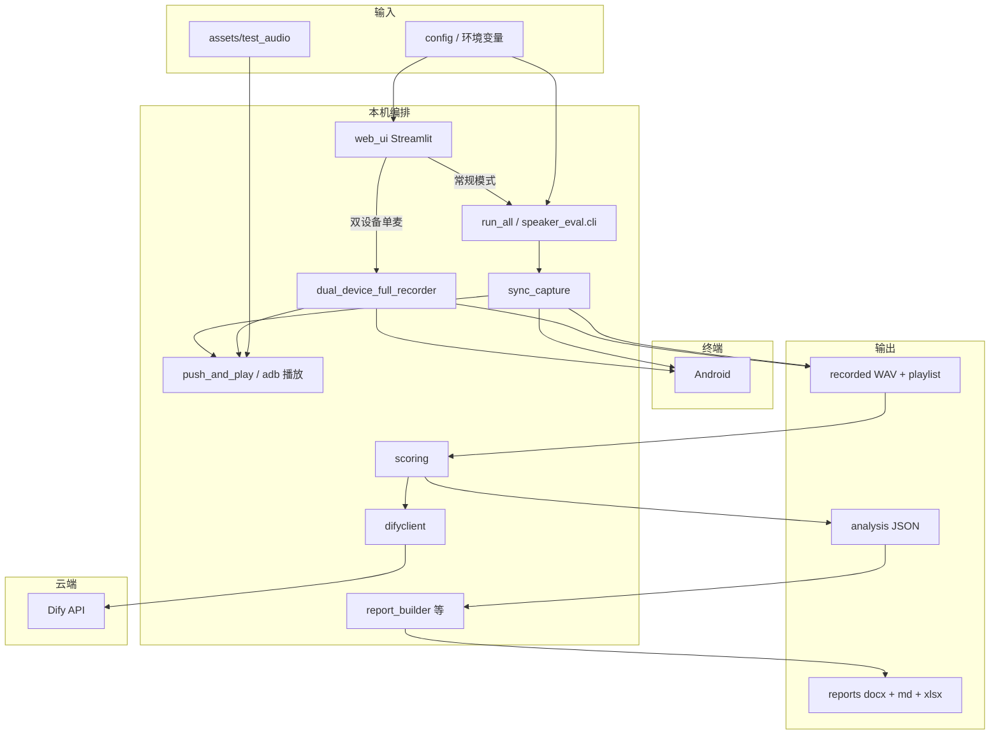

# 喇叭音效自动化 AI 评测系统 — 项目设计说明书

> **重要（易混）：Web「常规模式」与 CLI 多机「刺激比较」的评分语义不同**  
> Streamlit **「常规模式（原方案）」**侧栏仍填写 **两台设备序列号**，采集链路亦为双机顺序录音（`sync_capture` → `playlist`），但子进程会注入 **`SPEAKER_WEB_UI_REGULAR_USE_SINGLE_PROMPTS=1`**（见 `web_ui.py` → `web_ui_eval_worker.py`），使 **`scoring.score_recorded_session`** 对 **每台设备每条 WAV 单独**使用 **`scoring_query`（`web_ui_prompt_overrides.json`）打五维 1～10 绝对分**，**不做**同一音源下多附件同框的 **−3～+3 刺激比较差分**。  
> **`python run_all.py`（CLI）**：`playlist` 中登记 **多台设备** 且未显式关闭比较逻辑时，默认仍走 **刺激比较**（五维分差，被测相对对比）。  
> **请勿**将 Web 常规与 CLI 默认多机结论混为同一「对比口径」；若 HTTP `local_service` 或 CLI 需与 Web 常规一致，须在环境中 **显式设置 `SPEAKER_WEB_UI_REGULAR_USE_SINGLE_PROMPTS=1`** 并统一提示词与音源勾选。

## 文档信息

| 项目 | 内容 |
| --- | --- |
| 文档版本 | **1.7**（V1.3 外发 ZIP 打包流程、``一键安装依赖.bat``、发行包排除项与占位音源说明） |
| 程序版本 | **V1.3**（外发压缩包目录名：`speaker_audio_eval_V1.3_YYYYMMDD`，仅 ASCII） |
| 代码根目录 | **项目根目录**（本仓库目录如 `audio_evaluation_projectV1.3`；`config` / `speaker_eval.settings.paths.BASE_DIR` 默认解析为该目录，可用环境变量 **`SPEAKER_BASE_DIR`** 整体迁移） |
| 运行形态 | 本地 Python 流水线；**Streamlit Web UI**；可选 **FastAPI**；**无** Docker / **无** Dify Agent 内嵌 |
| 用户向说明 | **[使用说明.md](./使用说明.md)**（开发/运维：安装、启动、环境变量）；**[外发使用说明.md](./外发使用说明.md)**（接收 ZIP 方开箱步骤） |
| 修订记录 | 见文末 **附录 A** |

---

## 目录

1. [执行摘要](#1-执行摘要)
2. [系统目标与边界](#2-系统目标与边界)
3. [术语与角色](#3-术语与角色)
4. [总体架构与数据流](#4-总体架构与数据流)
5. [功能需求一览](#5-功能需求一览)
6. [模块与文件职责](#6-模块与文件职责)
7. [数据结构与量表](#7-数据结构与量表)
8. [接口说明](#8-接口说明)
9. [配置与环境变量](#9-配置与环境变量)
10. [目录与输出产物](#10-目录与输出产物)
11. [质量风险与运维要点](#11-质量风险与运维要点)
12. [部署与运行步骤](#12-部署与运行步骤)
13. [扩展方向](#13-扩展方向)
14. [附录](#附录-a-修订记录)

---

## 1. 执行摘要

**本系统是做什么的**

在 Windows 下，用 **标准音源 → 安卓喇叭外放 → PC 麦克风录音 → Dify 大模型打分**，完成内置喇叭的 **半自动化主观听感评测**，并输出 **JSON 分析结果**、**Word 报告**、**Markdown 表** 及 TSV/Excel 等（便于进 Excel 或后处理）。

**典型使用形态**

| 形态 | 说明 |
| --- | --- |
| **CLI** | `python run_all.py`（根入口转发 `speaker_eval.cli.main`） |
| **Web UI** | `streamlit run web_ui.py` 或 **`启动WebUI.bat` / 启动程序.bat 选项 3** |
| **HTTP** | `python local_service.py`，供 Dify 工作流等以 HTTP 触发 |
| **外发交付** | 解压 **`speaker_audio_eval_V1.3_*.zip`** → 双击 **`一键安装依赖.bat`** 或 **`启动WebUI.bat`**（详见 **[外发使用说明.md](./外发使用说明.md)**） |

**三条硬约束**（多机刺激比较仍适用）

| 约束 | 说明 |
| --- | --- |
| 单路麦克 | 任意时刻只录一台设备外放，避免多机混进一轨（**双设备单麦模式**下为分时录制，仍满足「一轨一机」） |
| 刺激一致 | 多机对比时，同一节目用同一素材，只换播放终端 |
| 角色可对齐 | 多机时 **d01 = 被测（DUT）**、**d02 = 对比（REF）**，与 Dify 分差语义一致 |

**典型一条命令（CLI）**

```text
cd <项目根目录>
python run_all.py
```

多设备且需无人值守时：`python run_all.py --yes`（仍在项目根目录执行）。

---

## 2. 系统目标与边界

### 2.1 建设目标

- 可重复、可追溯的评测流水线（会话隔离、文件命名规范）。
- 支持 **多机刺激比较**（五维 −3～+3，被测相对对比）与 **单机绝对分**（五维 1～10 + 综合分）。
- 支持 **Streamlit 界面**：设备/麦克风选择、音源勾选、**侧栏「大模型 / 评测模型」多选**（顺序即评测顺序，首项同步 `SPEAKER_EVAL_MODEL_NAME`）、按模型 **Dify 专钥映射**、提示词覆盖、五维图表与报告导出。
- 支持 **双设备单麦对比模式（Web UI）**：单麦固定摆位，按节目分时录制两台 Android，配对送 Dify 刺激比较并生成与流水线一致的清单/分析/报告链路。
- 报告侧：**逐条节目真实路径名**、固定五维列、维度统计与一句话整体评述。

### 2.2 范围内 / 范围外

| 类别 | 内容 |
| --- | --- |
| **范围内** | ADB 推送与播放、本机 WAV 采集、Dify Chat 与文件上传、playlist/analysis 持久化、Word + Markdown（+ TSV/Excel 等）、Web UI 编排 |
| **范围外** | 产线 MES、多麦阵列算法、人耳终裁替代；Dify **工作流编排与模型选型** 由平台维护 |

---

## 3. 术语与角色

| 术语 | 解释 |
| --- | --- |
| **音源 / 节目** | `assets/test_audio` 下扫描到的文件；清单字段 `source` 为相对路径，与报告「节目」列一致 |
| **槽位 `d01` / `d02`** | 本会话内设备顺序号，写入 WAV 文件名与 `playlist.json` |
| **刺激比较** | 同一 `source` 下多路分时录音，一次请求送多附件；模型输出五维 **整数分差** |
| **`session_tag`** | 会话标签（如 `manual_YYYYMMDD_HHMMSS`），贯穿录制与分析命名 |
| **常规模式（Web UI）** | 双机采集与 CLI 同源（`sync_capture` → `scoring`），但子进程固定 **`SPEAKER_WEB_UI_REGULAR_USE_SINGLE_PROMPTS=1`**：**逐设备逐条 WAV 单机绝对分**（1～10），**非**多路刺激比较差分；文首「易混」说明 |
| **双设备单麦模式（Web UI）** | `dual_device_full_recorder.DualDeviceFullRecorder`：推送双机、按节目顺序录 A 再录 B，playlist 驱动配对评分 |

---

## 4. 总体架构与数据流

### 4.1 逻辑架构图



### 4.2 主数据流（步骤视角）

| 步骤 | 动作 | 主要产出 |
| --- | --- | --- |
| ① | 枚举 ADB、多机时确认 DUT/REF（CLI 可 `--yes`；Web UI 侧栏选择） | 有序设备列表 |
| ② | 扫描音源、推送至各机 | 终端侧测试文件 |
| ③ | 按「节目 × 设备」循环：播放 + PC 录音（双设备模式：每节目先 A 后 B） | `*.wav`、`{safe_tag}_playlist.json` |
| ④ | 读清单，单机逐条 / 多机按节目合并送 Dify | `analysis_*.json` |
| ⑤ | 解析模型 JSON，生成报告 | `声学评测报告_*.docx`、`.md` 等 |

---

## 5. 功能需求一览

| ID | 需求简述 | 主要落点 |
| --- | --- | --- |
| F1 | 自动发现已连接设备 | `speaker_eval.adapters.adb.list_connected_adb_devices` |
| F2 | 多机 DUT/REF 确认与重排 | `device_roles`、`run_all` / Web UI 侧栏 |
| F3 | 音源列表与播放顺序 | `config.discover_standard_tracks`；Web UI 勾选写入 `SPEAKER_SELECTED_TRACKS_JSON` |
| F4 | 每条有效录音时长可配 | `PER_TRACK_PLAY_SECONDS`、`--seconds` |
| F5 | 同会话多机刺激比较 | `difyclient.analyze_audios_stimulus_compare` |
| F6 | 单机绝对分 | `difyclient.analyze_audio`、`SCORING_QUERY` |
| F7 | 跨会话对齐对比（可选） | `scoring.score_cross_session_pairwise` |
| F8 | 五维表 + 统计 + 一句话评述 | `markdown_report`、`gen_report` |
| F9 | HTTP 触发全流程（可选） | `local_service` |
| F10 | Web UI：设备/麦克风/音源/全流程与图表 | `web_ui.py`、`web_ui_eval_worker.py`、`eval_source_summary.py` |
| F11 | 双设备单麦完整录制与配对评分 | `dual_device_full_recorder.py`、`dual_device_scoring.py` |
| F12 | Web UI **多模型**同会话：首模型主跑，其余复用录音追加评分/报告；`web_ui_scores_*.json` 写入评测模型与按轨摘要 | `web_ui.py`、`web_ui_multi_model_reports.py`、`run_all._write_web_ui_score_json`、`scoring.eval_model_tags_for_track_row` |

---

## 6. 模块与文件职责

### 6.0 代码模块树（项目根目录）

以下树为**对外交付与维护的主结构**；工作目录、双击脚本与命令行均以该目录为根（`BASE_DIR` 默认解析为该目录）。

```text
<项目根目录>/
├── 📍 主入口

│   ├── config.py                     # 路径、参数、麦克风、Dify、音源；薄封装 → speaker_eval.settings；导出 Web UI 默认项
│   ├── recording_config.py           # 录音采样率等工程级常量（经 settings 导出）
│   └── run_all.py                    # CLI 转发；含 Web UI 调用的 main_run_eval、时长/增益补丁等
│
├── ⚙️  配置中心
│
├── 🎛️  设备与角色管理
│   └── device_roles.py               # 被测机 / 对比机 确认、排序、交互
│
├── 🎵 音频播放与同步录制
│   ├── push_and_play.py              # ADB 推送音频、控制播放（sync_capture 等调用）
│   ├── sync_capture.py               # 多设备同步采集；PC 端录音经 speaker_eval.adapters.audio
│   ├── adb_audio_playback.py         # Android 侧播放触发等（dual_device 与同步链路复用）
│   └── omnimic_recorder.py           # OmniMic 试录、增益、校验；声学特征（可选 librosa）
│
├── 🔀 双设备单麦（Web UI 模式）
│   ├── dual_device_full_recorder.py   # 完整流程：扫描→推送→按节目分时录 A/B→playlist
│   ├── dual_device_scoring.py        # 配对评分与 analysis 衔接
│   └── dual_device_recorder.py       # legacy / 辅助组件（按仓库实际引用为准）
│
├── 🧠 AI 评分与 Dify 交互
│   ├── difyclient.py                 # Dify API：上传、Chat、多路音频比较
│   └── scoring.py                    # 读取录音 → 调用 AI → 输出评分 JSON
│
├── 📊 报告生成
│   ├── markdown_report.py            # Markdown 表、维度统计、结论句式
│   ├── report_builder.py             # 数据模型统一、汇总、Word/Markdown/TSV/Excel
│   └── gen_report.py                 # Word 排版与导出
│
├── 🖥️ Web UI
│   ├── web_ui.py                     # Streamlit：侧栏设备/麦克风、模型多选与专钥、常规/双设备模式、图表与导出
│   ├── web_ui_eval_worker.py         # 子进程入口：应用 env 与解析后的 DIFY_API_KEY 后调用 main_run_eval（便于停止子进程）
│   ├── web_ui_dify_model_keys.py     # web_ui_dify_api_keys_by_model.json：按模型名切换 Dify Key；审计日志（仅后缀）
│   ├── web_ui_model_list_config.py   # 侧栏模型候选项：专钥映射键名优先 → web_ui_model_list.json → 内置+自定义
│   ├── web_ui_multi_model_reports.py # 多模型追加评分/报告时切换 SPEAKER_EVAL_MODEL_NAME 等
│   └── eval_source_summary.py        # analysis / web scores → DataFrame / 汇总行（含逐音源明细标量提取）
│
├── 📝 运行期日志（Web / 流水线）
│   └── live_eval_log.py              # 步骤追加，供界面「实时步骤」展示
│
├── 🌐 API 服务（可选）
│   └── local_service.py              # FastAPI：一键评测、健康检查
│
├── 🪟 启动脚本（Windows）
│   ├── 一键安装依赖.bat              # 仅创建 .venv 并 pip install（不启动界面）
│   ├── 启动程序.bat                  # 菜单：CLI / HTTP / Web UI / 退出
│   └── 启动WebUI.bat                 # 直达 Streamlit
│
├── speaker_eval/                     # 子包：settings / adapters / pipelines / cli
├── assets/test_audio/                # 标准音源
├── requirements.txt                  # 主依赖；可选 requirements-nisqa.txt、requirements-pdf.txt
├── scripts/                          # 维护脚本（如 setup_nisqa_weights、build_release_package）
├── self_test.py                      # 环境与依赖自检（可选）
├── record_audio.py                   # 单文件试录封装（可选）
├── tools/                            # 辅助脚本（如 gen_placeholder_wavs 占位音源）
├── 外发使用说明.md                   # 接收 ZIP 方开箱说明
├── 使用说明.md / 项目设计说明书.md   # 用户与设计与本文
└── dist/                             # 打包输出（仅开发机；不进外发 ZIP）
```

**说明**

- **录音后端**：`sync_capture` / `dual_device_full_recorder` 通过 `speaker_eval.adapters.audio` 统一采集（sounddevice / OmniMic / 外部 CLI）。
- **CLI**：根目录 `run_all.py` 转发至 `speaker_eval.cli.main`；日志默认 **`output/logs/`**。
- **可选文件**：`tsv_report.py`、`excel_summary.py` 等供报告导出链路使用。

### 6.1 总览表（优先阅读）

| 模块 / 文件 | 职责一句话 | 典型入口 |
| --- | --- | --- |
| `config.py` | 路径、录制参数、Dify 默认端点、音源发现 | `discover_standard_tracks` |
| `run_all.py` | CLI；`main_run_eval` 供 Web 调用 | `main()` / `main_run_eval(...)` |
| `device_roles.py` | 多机被测/对比交互与序列重排 | `confirm_dut_ref_interactive` |
| `sync_capture.py` | 推送计划、多机采集、写 playlist | `run_multi_device_capture` |
| `dual_device_full_recorder.py` | 双设备单麦：按节目分时录制与清单 | `DualDeviceFullRecorder` |
| `push_and_play.py` | ADB push / 播放 | 被采集层调用 |
| `omnimic_recorder.py` | OmniMic 试录、写 WAV、`--validate` | `python omnimic_recorder.py` |
| `difyclient.py` | 文件上传、Chat、多路音频比较 | `DifyClient` |
| `scoring.py` | 读 WAV + playlist，调 Dify，写 analysis JSON | `score_recorded_session` |
| `report_builder.py` | analysis → 统一行模型 → Word/Markdown/表格 | `build_word_from_analysis` |
| `markdown_report.py` | Markdown 表与维度统计 | `render_evaluation_markdown` |
| `gen_report.py` | Word 文档排版 | `generate_report` |
| `web_ui.py` | Streamlit 全流程与可视化；子进程常规评测 | `streamlit run web_ui.py` |
| `web_ui_eval_worker.py` | 子进程包装 `main_run_eval`，继承父进程传入的 `env` 与 `dify_api_key_resolved` | `python web_ui_eval_worker.py <cfg.json> <out.json>` |
| `web_ui_dify_model_keys.py` | 模型名 → 专钥映射；与侧栏全局 `DIFY_API_KEY` 组合使用 | `configure_api_key_for_model` |
| `web_ui_model_list_config.py` | 合并内置/自定义与专钥表、可选 `web_ui_model_list.json` | `effective_model_choices` |
| `web_ui_multi_model_reports.py` | 同会话录音下多模型追加流水线 | 由 `web_ui` 在补评/双设备多模型路径调用 |
| `eval_source_summary.py` | 从 score/analysis JSON 构造逐音源汇总表（供 Web UI 展示） | `load_analysis_from_score_json_path` 等 |
| `local_service.py` | FastAPI：`run_eval`、`health` | `POST /api/v1/run_eval` |
| `启动程序.bat` | 菜单启动 CLI / HTTP / Web UI | — |
| `一键安装依赖.bat` | 创建 `.venv` 并安装 requirements（含可选 NISQA/PDF） | — |
| `scripts/build_release_package.py` | 生成外发 ZIP 与解压目录（维护方） | `python scripts/build_release_package.py --with-placeholders` |

### 6.2 模块要点（补充）

- **`sync_capture`**：WAV 命名 `{safe_tag}_{idx:02d}_{slot}_{group}_{stem}.wav`；`device_role_labels` 写入 `devices[].label`。
- **`dual_device_full_recorder`**：与常规模式一致地扫描 `assets/test_audio`、推送双机；按节目循环「设备 A 播放+录音 → 设备 B 播放+录音」；支持 `SPEAKER_PLAY_FULL_TRACK` 等与 Web UI 对齐的行为。
- **`difyclient`**：上传侧可采用 ASCII 短文件名，降低网关对长文件名校验失败概率；刺激比较支持「先上传、再带 `upload_file_id` 对话」，重试时复用附件。音频经 **`audio_llm_normalize`** 做 **48 kHz / 单声道 / PCM_16** 制式转换（**不做**响度归一化），再上传。
- **`scoring`**：单机行带 `track_index`、`stimulus`、`group`，保证报告「节目」与音源路径一致；`_extract_json_object` 兼容 Markdown 围栏；可按环境变量 **`DIFY_STIMULUS_COMPARE_MAX_ATTEMPTS`**（默认 3）对刺激比较做有限次完整对话重试；`tracks[]` 可写 **`eval_model` / `dify_selected_model`** 供多模型区分。

---

## 7. 数据结构与量表

### 7.1 `playlist.json`（逻辑字段）

| 字段 | 含义 |
| --- | --- |
| `version` | 当前为 `2` |
| `session_tag` / `safe_tag` | 会话与文件安全前缀 |
| `devices[]` | `slot`、`serial`、`label`（如被测/对比） |
| `items[]` | `index`、`group`、`source`、`device_remote` |

### 7.2 `analysis_*.json`（逻辑字段）

| 字段 | 含义 |
| --- | --- |
| `comparison_mode` | 是否多机刺激比较 |
| `scoring_rule_set` | pairwise / single 等标识 |
| `playlist` / `devices` | 与录制一致，供报告还原节目名 |
| `tracks[]` | `parsed`、`stimulus`、`track_index`、`file`；多模型场景可含 **`eval_model` / `dify_selected_model`** 等 |

### 7.3 评分量表对照

| 模式 | 五维含义 | 其它字段 |
| --- | --- | --- |
| **多机** | 整数 **−3～+3**，正 = 被测优于对比 | 对比总结、专业点评 |
| **单机** | 整数 **1～10** | 综合分（一位小数）、专业点评 |

报告侧五维列名固定为：**声音响度、人声清晰度、听感舒适度、失真与噪声、频响平衡**。

### 7.4 `web_ui_scores_{safe}.json`（Web UI 图表与历史加载）

由 **`run_all._write_web_ui_score_json`** 在 `main_run_eval` 成功后写入项目根目录（与 `analysis_*.json` 同会话 `safe` 前缀）。在 **`analysis_*.json`** 五维汇总之外，增加与 **评测模型** 相关的字段，便于多模型并存时对账：

| 字段 | 含义 |
| --- | --- |
| `web_ui_eval_model` / `eval_model` | 当前写入时的主评测模型展示名（通常与环境变量 `SPEAKER_EVAL_MODEL_NAME` 一致） |
| `dify_selected_model` | 若评分侧解析到 Dify 所选模型名，则一并落盘 |
| `per_track_eval_models` | 列表：每条 `tracks` 对应的 `track_index`、`stimulus`、`eval_model`、`dify_selected_model` 等（无信息的键会省略） |

---

## 8. 接口说明

### 8.1 命令行 `run_all.py` / `speaker_eval.cli.main`

| 参数 | 作用 |
| --- | --- |
| `-d` / `--device` | 可重复；限定 ADB 序列号子集 |
| `--quick` | 缩短预滚/尾；**不**默认缩短 30s 有效段 |
| `--seconds` | 覆盖每条有效录音秒数 |
| `--yes` | 多机跳过 DUT/REF 交互确认；非交互默认 sounddevice |
| `--record-tool` | `sounddevice` / `omnimic` / `ask` |

**退出码（常见）**：`0` 成功；`1` 未捕获异常；`2` 无有效录音；`3` 评分失败；`5` 用户取消设备确认。

### 8.2 编程接口 `run_all.main_run_eval`

供 **`web_ui.py`** 在同一进程内调用，或通过 **`web_ui_eval_worker`** 在子进程内调用：传入设备序列号、麦克风规格、时长、增益、会话标签等，完成采集 → 评分 → 报告（内部可补丁 `PER_TRACK_PLAY_SECONDS` / `OMNIMIC_GAIN_DB`，并在成功后调用 **`_write_web_ui_score_json`** 写入根目录 **`web_ui_scores_{safe}.json`**）。

### 8.3 HTTP `local_service.py`

| 方法路径 | 作用 |
| --- | --- |
| `GET /health` | 健康检查 |
| `POST /api/v1/run_eval` | JSON 控制采集 / 评分 / 报告及设备列表 |

请求体可选 **`dut_serial` + `ref_serial`**。响应含 **`report_docx`**、**`report_markdown`** 及 TSV/XLSX 等字段（以实现为准）。

### 8.4 Web UI `web_ui.py`

| 能力 | 说明 |
| --- | --- |
| 侧栏 | ADB 列表、麦克风枚举（含 Windows WASAPI 过滤选项）、Dify 配置、**音源勾选**（可持久化到 `web_ui_selected_tracks.json`） |
| 评估模型 | **单一 `multiselect`「大模型 / 评测模型（可多选）」**：顺序 = 多模型评测顺序；**首项**同步 `session_state["selected_llm_model"]` 与 **`SPEAKER_EVAL_MODEL_NAME`**（及 Dify `selected_model` 输入，若工作流声明）。内置展示名见 **`使用说明.md`** §4.1；可通过 `web_ui_custom_models.json` 扩展；候选项由 **`web_ui_model_list_config.effective_model_choices`** 合并 **专钥映射表 / `web_ui_model_list.json` / 内置+自定义**。 |
| 模式 | **常规** ↔ **双设备单麦**（`eval_mode`）；**常规**下虽为双机序列号采集，评分语义为 **各机单机绝对分**（见文首说明与 `SPEAKER_WEB_UI_REGULAR_USE_SINGLE_PROMPTS`） |
| 环境变量 | 勾选音源 → `SPEAKER_SELECTED_TRACKS_JSON`；整曲播放 → `SPEAKER_PLAY_FULL_TRACK`；**常规子进程固定** `SPEAKER_WEB_UI_REGULAR_USE_SINGLE_PROMPTS=1`（与 CLI/HTTP 默认多机刺激比较区分） |
| 子进程 | **常规双机评测**通过 `subprocess.Popen` 调用 **`web_ui_eval_worker.py`**，配置 JSON 含 `dify_api_key_baseline`、`dify_api_key_resolved` 与额外 `env`，避免子进程继承环境下 Key 与模型错配 |
| 提示词页 | 读写 **`web_ui_prompt_overrides.json`**（单机 `SCORING_QUERY` 草稿、双机刺激比较补充说明、`audio_eval_prompt` 等） |
| 历史预览 | 侧栏 **历史数据预览**：`output/analysis/web_ui_scores_*.json`，支持按 **dual_webui_*** / 常规 / 多模型追加等筛选；命名与 `analysis` 配对见 **`eval_source_summary.analysis_json_path_for_web_scores`** |

### 8.5 外部 Dify

| 环节 | 要点 |
| --- | --- |
| 上传 | `POST /v1/files/upload`，`multipart`：`file`、`user` |
| 对话 | `POST /v1/chat-messages`，`files[]`：`type: audio`、`transfer_method: local_file`、`upload_file_id` |
| 集成前提 | Chatflow 允许 **音频 / wav**；LLM 节点必须挂载多模态附件 |

---

## 9. 配置与环境变量

| 变量 | 用途 |
| --- | --- |
| `SPEAKER_BASE_DIR` | 覆盖项目根（assets/output 整体迁移） |
| `SPEAKER_PER_TRACK_SEC` | 每条有效录音时长（秒） |
| `SPEAKER_PRE_ROLL_SEC` / `SPEAKER_POST_TAIL_SEC` | 预滚、尾缓冲 |
| `SPEAKER_INPUT_DEVICE` | 麦克风：设备号或名称子串 |
| `SPEAKER_RECORD_TOOL` | `sounddevice` / `omnimic` |
| `SPEAKER_SELECTED_TRACKS_JSON` | Web UI 勾选音源列表（JSON 数组） |
| `SPEAKER_PLAY_FULL_TRACK` | 是否按整曲时长播放 |
| `DIFY_API_KEY` / `DIFY_API_URL` / `DIFY_FILE_UPLOAD_URL` / `DIFY_USER` | Dify 调用；**`DIFY_USER`** 须与租户要求一致，否则常见 **User Not Exists（400）** |
| `DIFY_AUDIO_EVAL_PROMPT` / `DIFY_AUDIO_EVAL_PROMPT_MAX_LEN` / `DIFY_OMIT_AUDIO_EVAL_PROMPT_INPUT` | 短字段 `audio_eval_prompt` 与截断/省略策略 |
| `DIFY_SELECTED_MODEL` / `SPEAKER_EVAL_MODEL_NAME` / `DIFY_OMIT_SELECTED_MODEL_INPUT` | 写入或省略 `inputs.selected_model`；Web UI 以多选 **首项** 同步 `SPEAKER_EVAL_MODEL_NAME` |
| `DIFY_STIMULUS_COMPARE_MAX_ATTEMPTS` | 刺激比较解析失败时的最大完整对话次数（默认 **3**）；重试复用已上传附件 id |
| `SPEAKER_WEB_UI_LIVE_LOG` | 子进程步骤 JSONL 路径（由 `web_ui_eval_worker` 设置，供界面实时日志） |
| `SPEAKER_WEB_UI_REGULAR_USE_SINGLE_PROMPTS` | Web 常规子进程由 `web_ui` **固定为 1**：`score_recorded_session` 走 **逐机绝对分**；CLI/HTTP 若需同语义须自行设为 **1** |
| `SPEAKER_AI_HOST` / `SPEAKER_AI_PORT` | 本地 HTTP 服务 |

**本地 JSON（可选，根目录）**：`web_ui_dify_api_keys_by_model.json`（模型名→专钥）、`web_ui_model_list.json`、`web_ui_custom_models.json`、`web_ui_prompt_overrides.json`、`web_ui_selected_tracks.json` — 与 **`使用说明.md`** §4.4 一致。

默认值与更多项见 **`speaker_eval/settings/`**、**`config.py`** 及 **`使用说明.md`** §6。

---

## 10. 目录与输出产物

```text
<项目根目录>/
├── assets/test_audio/          # 标准音源（可分子目录）
├── output/
│   ├── recorded/               # WAV、{safe_tag}_playlist.json
│   ├── analysis/               # analysis_*.json
│   ├── reports/                # 声学评测报告_*.docx、*.md、*.xlsx 等
│   └── logs/                   # 运行日志
├── web_ui_scores_*.json        # Web UI 图表分与模型元数据（与 analysis 同会话前缀时成对出现）
├── models/nisqa/             # NISQA 权重（setup_nisqa_weights.py 下载，.tar 不入库）
├── run_all.py
├── web_ui.py
├── 项目设计说明书.md
├── 使用说明.md
├── 外发使用说明.md
└── …（其余源码模块）
```

**外发 ZIP 与开发目录的差异**：发行包由 `scripts/build_release_package.py` 生成，**不包含** `.venv`、`.git`、`dist/`、历史 `output/` 产物、真实 **`web_ui_dify_api_keys_by_model.json`** / **`web_ui_provider_model_map.json`**、用户本地 **`web_ui_selected_tracks.json`** 等；解压后自带空 **`output/*`** 与 **`models/nisqa/`** 占位说明。默认使用 **`--with-placeholders`** 时在包内生成 **16 条静音试跑 WAV**（曲艺/语声各 8），正式评测需自行替换真实素材。

---

## 11. 质量风险与运维要点

| 现象 | 处理建议 |
| --- | --- |
| RMS 近 0、听感明显有声 | 检查默认输入设备、`SPEAKER_INPUT_DEVICE`、摆位 |
| Dify 400「File validation failed」 | 应用侧开启音频类型；本端已用短文件名上传 |
| 模型称「未收到音频」 | 工作流未把附件接到多模态 LLM |
| 旧单机 JSON 节目列异常 | 新流水已写 `track_index`/`stimulus`；旧文件依赖文件名 `_NN_dXX_` 解析 |
| 流程中断 | 按 `session_tag` 隔离；可对已有 `analysis.json` 执行 `python report_builder.py <路径>` 补报告 |
| Web UI 与 CLI 结果口径不一致 | **常规模式**：核对文首说明——Web 为 **逐机绝对分**，CLI 多机默认可为 **刺激比较差分**；需同口径时在 CLI/HTTP 显式设 **`SPEAKER_WEB_UI_REGULAR_USE_SINGLE_PROMPTS=1`**。另核对时长/增益/音源勾选/测评模式 |
| Vertex / Gemini 报 **Top‑K** 非法 | 在 **Dify 应用** 内将对应 LLM 节点的 **Top‑K** 调到提供商允许范围（常见 **1～63**）；非本仓库客户端字段 |
| 刺激比较反复失败 | 检查 **`DIFY_STIMULUS_COMPARE_MAX_ATTEMPTS`**、工作流附件是否接入多模态、模型 temperature |

---

## 12. 部署与运行步骤

### 12.1 开发机 / 本仓库

1. **环境**：Python **3.10 或 3.11（64 位，推荐）**；依赖见 `requirements.txt`（可选 `requirements-nisqa.txt`、`requirements-pdf.txt`）。
2. **虚拟环境**：双击 **`一键安装依赖.bat`**，或由 **`启动WebUI.bat` / `启动程序.bat`** 在首次运行时自动创建 **`.venv`** 并 `pip install`。
3. **ADB**：`adb devices` 中目标为 `device`。
4. **音源**：放入 `assets/test_audio`；试跑可执行 `tools/gen_placeholder_wavs.py`。
5. **Dify**：配置密钥与工作流 URL；模型支持音频附件。
6. **执行（任选）**
   - 双击 **`启动程序.bat`**：菜单 **1** CLI / **2** HTTP / **3** Web UI；
   - 双击 **`启动WebUI.bat`**；
   - 命令行（推荐用虚拟环境）：`.\.venv\Scripts\python.exe run_all.py` 等。
7. **CI / 计划任务**：CLI 加 `--yes`，并预设 `SPEAKER_RECORD_TOOL`、`DIFY_*` 等。

### 12.2 外发 ZIP 交付（接收方）

1. 解压 **`speaker_audio_eval_V1.3_YYYYMMDD.zip`** 至本机目录（勿复制他人 `.venv`）。
2. 按 **[外发使用说明.md](./外发使用说明.md)**：安装 Python 3.10/3.11、配置 adb → 双击 **`一键安装依赖.bat`** → **`启动WebUI.bat`** → 侧栏配置 **`DIFY_API_KEY`**。
3. 详细排障与安全提示以外发文档为准。

### 12.3 维护方重新打包

在项目根目录执行：

```text
python scripts/build_release_package.py --with-placeholders
```

产物写入 **`dist/`**：同名文件夹 + **`speaker_audio_eval_V1.3_YYYYMMDD.zip`**（英文目录名）。可选参数：`--out-dir`、`--no-zip`（仅文件夹）。打包前勿将含密钥的 JSON 放入将被复制的路径；脚本已排除常见本地密钥与用户状态文件。

---

## 13. 扩展方向

- `BASE_DIR` 与密钥全面环境变量化，便于多副本部署。
- 增加官方子命令「仅重出报告」封装（当前等价于 `python report_builder.py <analysis.json>`）。
- 与 Jira / 测试平台对接：回写 `session_tag` 与 `analysis` 路径。

---

## 附录 A：修订记录

| 版本 | 日期 | 说明 |
| --- | --- | --- |
| 1.0 | 2026-04-15 | 首版，与代码行为对齐 |
| 1.1 | 2026-04-15 | 优化结构：目录、执行摘要、步骤表、模块总览表、附录归并 |
| 1.2 | 2026-04-15 | 入档交付目录模块树（§6.0）；代码根目录说明与 F1 落点更新；补充 `omnimic_recorder` |
| 1.3 | 2026-05-06 | 同步 V1.1：**Streamlit Web UI**、**双设备单麦模式**、`run_all.main_run_eval`、`启动程序.bat`/`启动WebUI.bat`、F10/F11、架构图与接口节；项目根目录命名与 `SPEAKER_BASE_DIR`；新增用户文档 **[使用说明.md](./使用说明.md)** 引用 |
| 1.4 | 2026-05-12 | 侧栏 **「大模型 / 评测模型」合并多选**、**按模型 Dify 专钥**（`web_ui_dify_model_keys` / `web_ui_model_list_config`）、**`web_ui_scores` 模型元数据**（`per_track_eval_models` 等）、刺激比较 **`DIFY_STIMULUS_COMPARE_MAX_ATTEMPTS`** 与上传复用；模块树与 §8.4/§7.4/§9 扩充；与 **[使用说明.md](./使用说明.md)** 对齐 |
| 1.5 | 2026-05-13 | 文首增加 **Web「常规模式」与 CLI 多机刺激比较** 的评分语义差异说明；§3 术语「常规模式」、§8.4 模式/环境变量、§11 排障表与 **1.5** 版本信息同步 |
| 1.6 | 2026-05-13 | 侧栏 **历史数据预览**：``web_ui_scores_*`` 按 **dual_webui** / 常规 / 多模型追加等筛选；**``eval_source_summary.analysis_json_path_for_web_scores``** 文档串补充 **``dual_webui_*``** 与 ``analysis_{safe}_*`` 规则；§8.4 增补「历史预览」行 |
| 1.7 | 2026-05-22 | **V1.3 外发交付**：程序版本行、``一键安装依赖.bat``、``scripts/build_release_package.py``；§6.0 模块树修正与 ``dist/``；§10 外发 ZIP 差异说明；§12 拆分为开发机 / 接收方 / 维护方打包；引用 **[外发使用说明.md](./外发使用说明.md)** |
